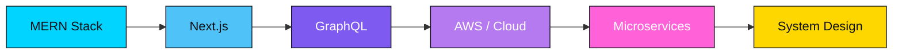

<div align="center">


<br/>


<a href="https://github.com/adeel-151?tab=followers"></a>
<a href="https://github.com/adeel-151"></a>

<br/><br/>

<a href="https://www.linkedin.com/in/adeel-qaiser151"></a>
<a href="https://www.instagram.com/adeel_qaiser_"></a>
<a href="https://www.facebook.com/iamadeel151"></a>
<a href="mailto:youremail@example.com"></a>
<a href="https://adeelqaiser.vercel.app/"></a>

<!-- 🔧 Only the Email badge above is still a placeholder — swap in your real address. LinkedIn, Instagram, Facebook, and Portfolio are already wired to your real profiles. -->

<br/><br/>

<a href="#-about-me">About</a> •
<a href="#-quick-facts">Quick Facts</a> •
<a href="#-tech-stack">Tech Stack</a> •
<a href="#-github-analytics">Analytics</a> •
<a href="#-featured-projects">Projects</a> •
<a href="#-beyond-the-code">Beyond the Code</a> •
<a href="#-lets-connect">Connect</a>

</div>

---

## 👨‍💻 About Me

> "Jack of all, master of none" — but I still ship production-grade code. 😄

I'm a **React Frontend Specialist** with full-stack **MERN** capability — I turn complex problems into clean, elegant, and blazing-fast web applications, blending a designer's eye with an engineer's precision.

- 🔭 Recently shipped a production-ready **School Management ERP** and architected a **Pakistan-focused multi-vendor marketplace**
- 🎓 **Ex-SMITian** — trained through Saylani Mass IT Training (SMIT)
- 🌱 Leveling up in **Next.js**, **GraphQL**, and **AWS**
- 💬 Ask me about **React**, **Node.js**, **TypeScript**, or **System Design**
- 🇵🇰 Based in Pakistan, building for local and global clients alike
- ⚡ Fun fact: I code with ☕ in one hand and 🎧 on loop — and chase the outdoors the moment the laptop closes

<div align="center">

[](https://github.com/piyushsuthar/github-readme-quotes)

</div>

---

## 📌 Quick Facts

<div align="center">

| 🧭 Primary Focus | 🛠️ Core Stack | 🎓 Trained At | 🤝 Open To |
|:---:|:---:|:---:|:---:|
| React Frontend Specialist (Full-Stack MERN) | MERN · TypeScript · Zustand | Saylani Mass IT Training (SMIT) | Freelance · Collabs · Mentoring |

</div>

---

## 🛠️ Tech Stack

<div align="center">


</div>

### 🎯 Frontend Engineering


### ⚙️ Backend & Database


### 🤖 AI Integration


### 🧰 Tools & DevOps


### 🧪 Currently Exploring


---

## 📊 GitHub Analytics

<p align="center">
  
  
</p>

<p align="center">
  
</p>

<p align="center">
  
</p>

<p align="center">
  
</p>

---

## 🐍 Contribution Snake

<p align="center">
<picture>
  <source media="(prefers-color-scheme: dark)" srcset="https://raw.githubusercontent.com/adeel-151/adeel-151/output/github-contribution-grid-snake-dark.svg">
  <source media="(prefers-color-scheme: light)" srcset="https://raw.githubusercontent.com/adeel-151/adeel-151/output/github-contribution-grid-snake.svg">
  
</picture>
</p>

<details>
<summary>⚙️ One-time setup (2 minutes) — click to expand</summary>
<br/>

This animated snake "eats" your contribution graph. It only works from a special repo named exactly like your username (`adeel-151/adeel-151`):

1. In that repo, create a file at `.github/workflows/snake.yml`
2. Paste the workflow below and commit it:

```yaml
name: Generate Snake Animation
on:
  schedule:
    - cron: "0 0 * * *"
  workflow_dispatch:
  push:
    branches:
      - main
jobs:
  generate:
    runs-on: ubuntu-latest
    timeout-minutes: 10
    steps:
      - name: Checkout
        uses: actions/checkout@v3
      - name: Generate snake animation
        uses: Platane/snk/svg-only@v3
        with:
          github_user_name: adeel-151
          outputs: |
            dist/github-contribution-grid-snake.svg
            dist/github-contribution-grid-snake-dark.svg?palette=github-dark
        env:
          GITHUB_TOKEN: ${{ secrets.GITHUB_TOKEN }}
      - name: Push to output branch
        uses: peaceiris/actions-gh-pages@v3
        with:
          github_token: ${{ secrets.GITHUB_TOKEN }}
          publish_dir: ./dist
          publish_branch: output
          commit_message: "Update snake animation [skip ci]"
```

3. The Action runs automatically every day — your snake starts eating fresh contributions 🐍

</details>

---

## 🏆 Featured Projects

<table width="100%">
<tr>
<td width="50%" valign="top">

### 🏫 School Management ERP
Large-scale, production-ready School Management System built on the MERN stack — five user roles with full role-based access control, live MongoDB aggregation charts, and a polished ink-blue, warm-paper, and muted-gold design system.

`React` `Node.js` `Express` `MongoDB` `RBAC`

🔗 [Live Demo](#) · [Repository](#)

</td>
<td width="50%" valign="top">

### 🛒 Multi-Vendor Marketplace
Daraz/Amazon-style multi-vendor e-commerce marketplace built for the Pakistani market — JazzCash, EasyPaisa, and Cash on Delivery payments, plus a companion AI layer for recommendations, search, chatbot support, and fraud detection.

`React` `Node.js` `Express` `MongoDB` `AI/ML`

🔗 [Live Demo](#) · [Repository](#)

</td>
</tr>
<tr>
<td width="50%" valign="top">

### 🏗️ Elite Engineers — Corporate Site
A premium corporate website for a Pakistan-based construction, engineering, and project-management firm — portfolio gallery, WhatsApp chat button, Google Maps integration, and quotation-request forms. My first paid client project.

`React` `Node.js` `Express` `MongoDB`

🔗 [Live Demo](#) · [Repository](#)

</td>
<td width="50%" valign="top">

### 🏥 MediCore — Clinic Management SaaS
A hackathon-built clinic management platform with a dark glassmorphism UI, Gemini AI integration, a jsPDF prescription generator, and role-based access for four distinct user types.

`React` `Node.js` `MongoDB` `Gemini AI` `jsPDF`

🔗 [Live Demo](#) · [Repository](#)

</td>
</tr>
<tr>
<td width="50%" valign="top">

### 🚀 XarKode — Software House Site
A marketing website for a software house, rebuilt pixel-for-pixel from a client-provided design — Framer Motion micro-interactions on the frontend, backed by a hardened Express/MongoDB API.

`React 18` `Vite` `Tailwind v4` `Framer Motion` `Express`

🔗 [Live Demo](#) · [Repository](#)

</td>
<td width="50%" valign="top">

### 💊 Shilajit 3D Product Landing
An immersive, single-file 3D product landing page — scroll-triggered animation and cinematic bloom lighting, built entirely with Three.js and GSAP.

`Three.js` `GSAP` `ScrollTrigger` `WebGL`

🔗 [Live Demo](#) · [Repository](#)

</td>
</tr>
</table>

<!-- 🔧 Swap the "#" links above for each project's real live demo and repo URLs -->

<div align="center">

*Also working through a 20 MERN Stack Projects Challenge, one build at a time — most recent: DevLura Jobs, a full job-portal platform.*

</div>

---

## 🎓 Beyond the Code

Outside of shipping code, I teach — I'm an academy instructor in Pakistan running **Digital Marketing** and **Social Media Marketing** courses, helping students go from zero to job-ready.

I'm also a proud **Ex-SMITian**, trained through Saylani Mass IT Training (SMIT) — the same practical, project-first approach I try to bring into my own classroom.

<div align="center">

🎯 **Full-Stack Development**  ·  📱 **Digital Marketing**  ·  📈 **Social Media Marketing**

</div>

---

## ☕ Support My Work

<div align="center">

If any of my projects saved you time or taught you something, consider fueling the next one:

<a href="#"></a>
<a href="#"></a>
<a href="https://github.com/sponsors/adeel-151"></a>

</div>

---

## 📈 Current Focus & Roadmap



---

<div align="center">

## 🤝 Let's Connect

Open to freelance work, collabs, and good conversations about frontend, MERN, or teaching the next batch of developers. Drop a ⭐ on a repo you like, or reach out on any of the links up top.

### ✨ Thanks for stopping by — feel free to explore, fork, and say hi 👋


</div>
