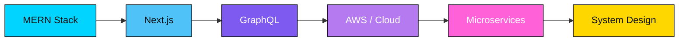

<div align="center">


<br/>


<a href="https://github.com/adeel-151?tab=followers"></a>
<a href="https://github.com/adeel-151"></a>

<br/><br/>

<a href="#"></a>
<a href="#"></a>
<a href="mailto:youremail@example.com"></a>
<a href="https://adeelqaiser.vercel.app/"></a>

<!-- 🔧 Replace the LinkedIn, X, and Email links above with your real profile URLs -->

</div>

---

## 👨‍💻 About Me

I'm a **MERN Stack Developer** and **Expert Frontend Engineer** who turns complex problems into clean, elegant, and blazing-fast web applications — blending a designer's eye with an engineer's precision.

- 🔭 Currently building scalable full-stack applications with the **MERN** ecosystem
- 🌱 Leveling up in **Next.js**, **GraphQL**, and **AWS**
- 💬 Ask me about **React**, **Node.js**, **TypeScript**, or **System Design**
- 🎯 Mission: ship production-grade applications with pixel-perfect precision
- ⚡ Fun fact: I code with ☕ in one hand and 🎧 on loop

<div align="center">

| 🧭 Focus | 🛠️ Core Stack | 🎯 Exploring Next | 🤝 Open To |
|:---:|:---:|:---:|:---:|
| Full-Stack Web Dev | MERN + TypeScript | Next.js · GraphQL · AWS | Collabs & Freelance Work |

<br/>

[](https://github.com/piyushsuthar/github-readme-quotes)

</div>

---

## 🛠️ Tech Stack

### 🎯 Frontend Engineering


### ⚙️ Backend & Database


### 🧰 Tools & DevOps


### 🧪 Currently Exploring


---

## 📊 GitHub Analytics

<p align="center">
  
  
</p>

<p align="center">
  
</p>

<p align="center">
  
</p>

<p align="center">
  
</p>

---

## 🐍 Contribution Snake

<p align="center">
<picture>
  <source media="(prefers-color-scheme: dark)" srcset="https://raw.githubusercontent.com/adeel-151/adeel-151/output/github-contribution-grid-snake-dark.svg">
  <source media="(prefers-color-scheme: light)" srcset="https://raw.githubusercontent.com/adeel-151/adeel-151/output/github-contribution-grid-snake.svg">
  
</picture>
</p>

<details>
<summary>⚙️ One-time setup (2 minutes) — click to expand</summary>
<br/>

This animated snake "eats" your contribution graph. It only works from a special repo named exactly like your username (`adeel-151/adeel-151`):

1. In that repo, create a file at `.github/workflows/snake.yml`
2. Paste the workflow below and commit it:

```yaml
name: Generate Snake Animation
on:
  schedule:
    - cron: "0 0 * * *"
  workflow_dispatch:
  push:
    branches:
      - main
jobs:
  generate:
    runs-on: ubuntu-latest
    timeout-minutes: 10
    steps:
      - name: Checkout
        uses: actions/checkout@v3
      - name: Generate snake animation
        uses: Platane/snk/svg-only@v3
        with:
          github_user_name: adeel-151
          outputs: |
            dist/github-contribution-grid-snake.svg
            dist/github-contribution-grid-snake-dark.svg?palette=github-dark
        env:
          GITHUB_TOKEN: ${{ secrets.GITHUB_TOKEN }}
      - name: Push to output branch
        uses: peaceiris/actions-gh-pages@v3
        with:
          github_token: ${{ secrets.GITHUB_TOKEN }}
          publish_dir: ./dist
          publish_branch: output
          commit_message: "Update snake animation [skip ci]"
```

3. The Action runs automatically every day — your snake starts eating fresh contributions 🐍

</details>

---

## 🏆 Featured Projects

<table width="100%">
<tr>
<td width="50%" valign="top">

### 🔥 E-Commerce Platform
Full-stack e-commerce solution with authentication, payment integration, and an admin dashboard.

`React` `Node.js` `Express` `MongoDB` `Stripe` `JWT`

🔗 [Live Demo](#) · [Repository](https://github.com/adeel-151/ecommerce-platform)

</td>
<td width="50%" valign="top">

### 📊 Analytics Dashboard
Real-time data visualization dashboard with interactive charts and live data feeds.

`React` `D3.js` `Socket.io` `Node.js` `MongoDB`

🔗 [Live Demo](#) · [Repository](https://github.com/adeel-151/analytics-dashboard)

</td>
</tr>
<tr>
<td width="50%" valign="top">

### 🧩 Portfolio Website
Modern, animated portfolio showcasing my work with a focus on performance and accessibility.

`Next.js` `TypeScript` `Tailwind CSS` `Framer Motion`

🔗 [Live Demo](https://adeelqaiser.vercel.app/) · [Repository](https://github.com/adeel-151/portfolio)

</td>
<td width="50%" valign="top">

### 🎓 University Map Project
Interactive campus map with building overlays and location-based search.

`HTML` `CSS` `JavaScript` `Leaflet.js`

🔗 [Live Demo](#) · [Repository](https://github.com/adeel-151/university-map-project)

</td>
</tr>
</table>

---

## ☕ Support My Work

<div align="center">

If any of my projects saved you time or taught you something, consider fueling the next one:

<a href="#"></a>
<a href="#"></a>
<a href="https://github.com/sponsors/adeel-151"></a>

</div>

---

## 📈 Current Focus & Roadmap



---

<div align="center">

### ✨ Thanks for stopping by — feel free to explore, fork, and say hi 👋


</div>
